# special-topics-in-RS
# Analysing the Changes of Lake Water Extent Using Remote Sensing 
- Lake in 1997, 2013 and 2020 were analyzed and interpreted with remote sensing data. For this, images of three years were obtained from Landsat 5 TM and Landsat 8 OLI / TIRS satellites.
-  NDVI was used to monitor the changes in water areas during the analysis phase. The images obtained as a result were classified and the area of the water areas was calculated.

# DATA SET
- 20 JULY 1997
 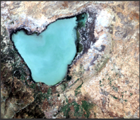
- LANDSAT 5 TM

- 17 AUGUST 2013
 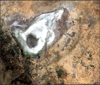
- LANDSAT 5 TM
 
- 4 AUGUST 2020
 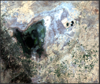
- LANDSAT 8 OLI/TIRS

# 1997
- NDVI
 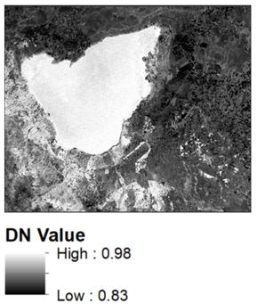
- ACCURACY ASSESSMENT
 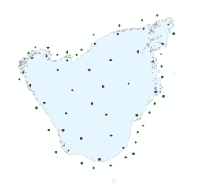
 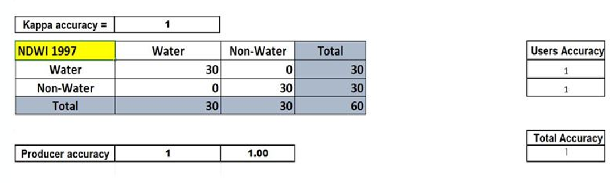
# 2013
- NDVI
 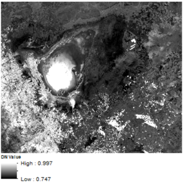
- ACCURACY ASSESSMENT
 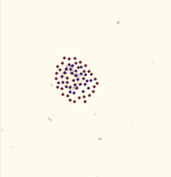
 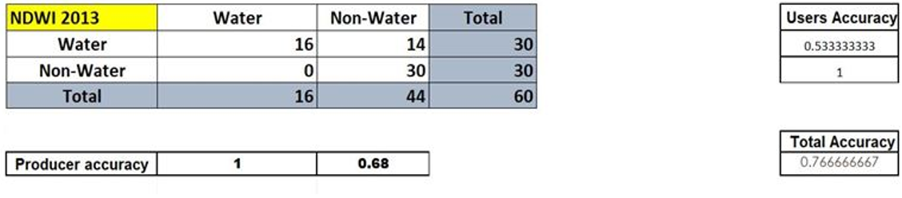
# 2020
- NDVI
 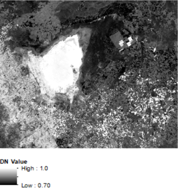
- ACCURACY ASSESSMENT
 
 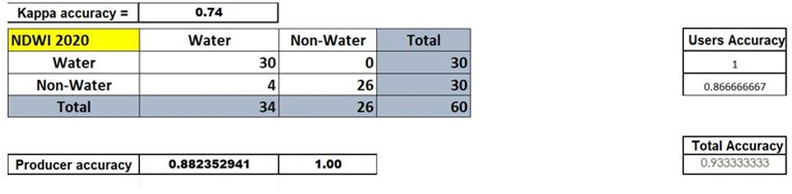
 # RESULT
 While comparing the results with the areas between the indexes in 1997 and 2013, NDVI was not that accurate and another operation should have been applied instead, while in 2020, NDVI gave the most accurate result.
